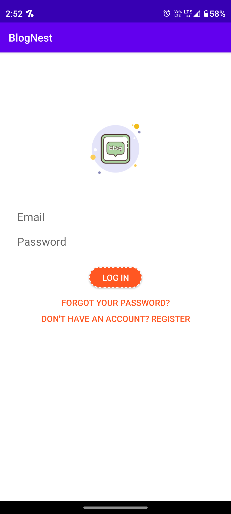
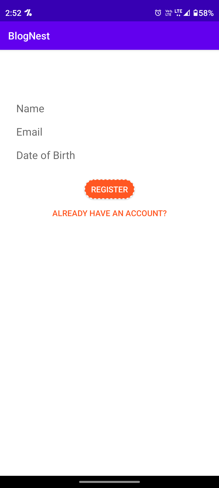
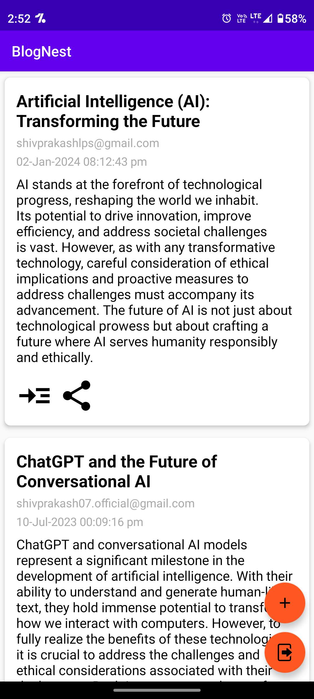
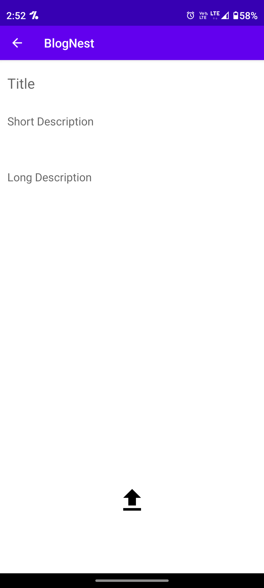

# BlogNest

BlogNest is a comprehensive open-source Android application developed by Shiv Prakash Verma, a student at IIT Ropar. The app enables users to create and publish blog posts seamlessly. It comes equipped with built-in features for user authentication and data storage using Firebase Authentication and Firebase Realtime Database.

## Features

- **User Authentication**: Secure user authentication using Firebase Authentication ensures a safe and reliable login process.
- **Blog Post Creation**: Users can easily create and publish their blog posts directly from the app.
- **Realtime Data Storage**: Utilizing Firebase Realtime Database ensures that data is stored and synchronized across devices in real-time.
- **Open Source**: The application is open-source, allowing developers to contribute, customize, and enhance its features.
- **Easy to Use**: With an intuitive user interface, BlogNest offers a seamless experience for both reading and creating blog content.
## Screenshots

## Contact Information

- **Developer**: Shiv Prakash Verma
- **Email**: shivprakashlps@gmail.com
- **College**: IIT Ropar

## Contributing

Contributions to BlogNest are welcome! Whether it's bug fixes, feature enhancements, or translations, feel free to contribute by opening issues or pull requests on GitHub.

## License

This project is licensed under the [MIT License](LICENSE).

